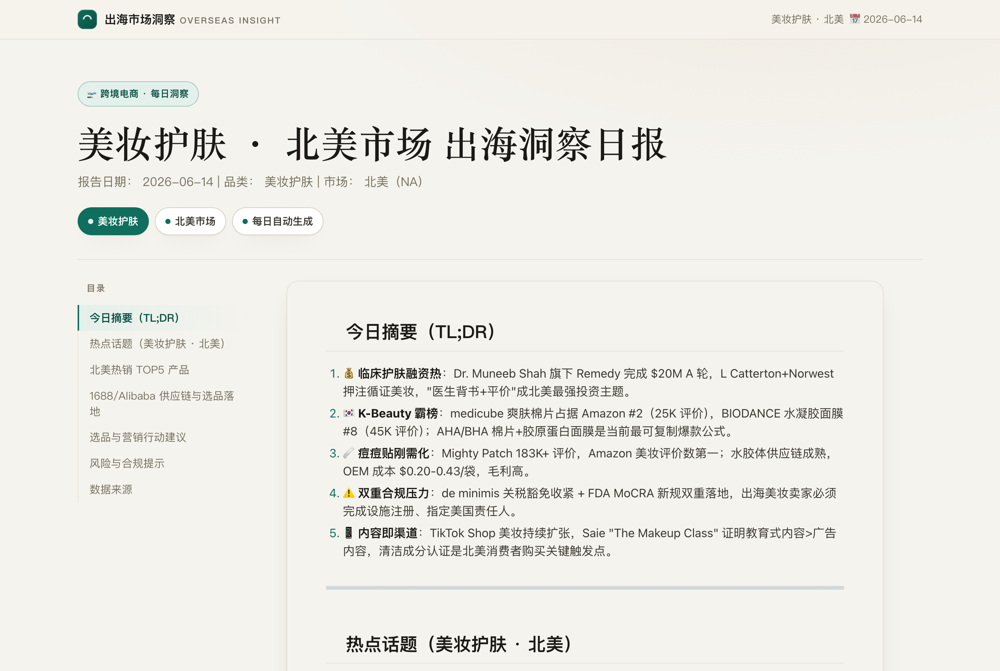
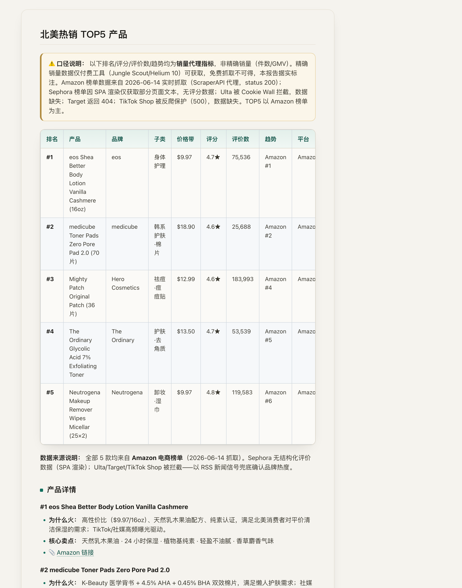
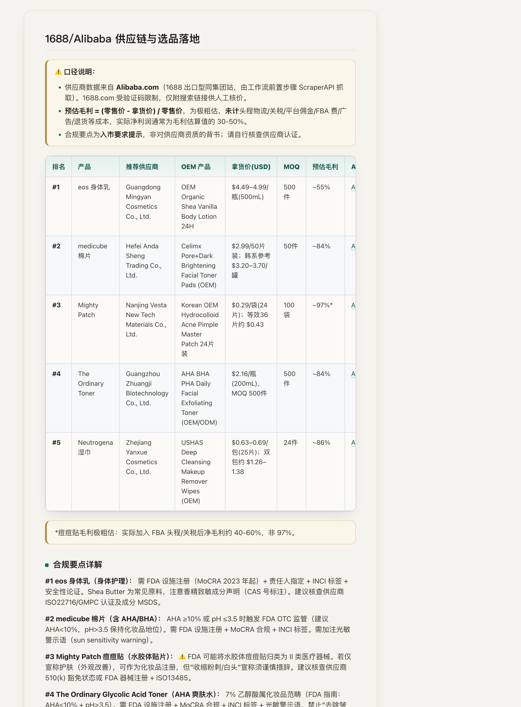

# 出海选品最耗时的 5 件事，我让一个 AI 智能体每天自动干完了

> 可直接发布的公众号草稿（商业向）。配图已就位：网页成品截图 + TOP5/供应链截图 + 两张逻辑图。

---

## 标题备选（公众号取标题用）

1. 出海选品最耗时的 5 件事，我让一个 AI 智能体每天自动干完了
2. 一个人、零服务器：我用 GitHub Copilot 把「市场情报 + 选品 + 供应链」做成了每日自动化
3. 不养分析师、不买贵工具：每天 5 点，它自动帮我盯北美爆品、配 1688 供应商、算毛利和合规

---

## 一、做跨境出海的人，每天都在重复这 5 件苦活

如果你做跨境电商，下面这条决策链一定很熟：

> **盯市场热点 → 看哪些产品在爆 → 找能供货的工厂 → 算一遍利润 → 确认能不能合规入市**

这条链上的每一环都很耗时：行业资讯散落在十几个英文站；电商榜单要一个个翻、还反爬；找供应商要在 1688/Alibaba 里大海捞针；毛利要手动估；合规要查 FDA、MoCRA……

一个选品，认真做完这套，**一个人小半天就没了**。要做得快、做得全，过去要么养一支小团队，要么买一堆订阅制数据工具（Jungle Scout、Helium 10、Similarweb，一年几千上万）。

我换了个思路：**让一个 AI 智能体每天自动把这条链跑一遍，产出一份能直接拿来做决策的日报。**

---

## 二、成果：一份每天自动更新的「决策级」日报

不用我开机、不用我点任何按钮。每天清晨 5 点，它自动生成一份 **「美妆护肤 · 北美市场 出海洞察日报」** 并发布成网页：

报告分三块，正好对应那条决策链：

### 1）市场在聊什么（热点话题）
过去 72 小时北美美妆的热点——临床护肤融资、Gen Alpha 护肤崛起、关税与合规收紧……每条都给「发生了什么 / 为什么重要 / 影响谁 / 接下来怎么做」，直接可用于选品和内容方向。

### 2）什么在卖爆（真实电商榜单）
TOP5 来自 **Amazon 畅销榜的真实数据**——真排名、真评分、真评价数、真价格，不是拍脑袋：

### 3）找谁供货、利润多少、能不能卖（供应链落地）
这是最值钱的一块：给每个爆品**自动匹配 1688/Alibaba 真实供应商 + 拿货价 + 预估毛利 + 合规要点**：

比如那款评价数 18 万+的痘痘贴：对应到「南京 Vesta」等工厂、$0.29/袋、MOQ 100，毛利空间一目了然——同时**明确提示**：FDA 可能按 II 类医疗器械监管，需核查 510(k)，别一头扎进去踩合规的坑。

---

## 三、它替你干了原本要花钱花人的 5 件事

| 原来怎么做 | 现在 |
|---|---|
| 翻十几个英文行业站找热点 | 自动聚合 + 提炼成可行动洞察 |
| 一个个翻电商榜（还反爬） | 自动抓 Amazon 真实榜单，排名/评分/评价数 |
| 1688/Alibaba 大海捞针找工厂 | 自动给每个爆品配真实供应商 + 拿货价 + MOQ |
| Excel 手动估毛利 | 自动按「零售价−拿货价」给毛利区间 |
| 查 FDA/MoCRA 合规 | 每个产品附入市合规要点 |

**等于把一名「市场分析师 + 选品 + 采购 + 合规」的日常初筛，压缩成一份每天自动更新的日报。** 人只需要在它的基础上做判断，而不是从零开始搜集信息。

---

## 四、为什么敢拿它做决策？——可控、诚实、可追溯

AI 报告最怕「看着专业、其实在编」。这套之所以能商用，是因为守住了三条线：

- **数据诚实**：免费抓取拿不到精确销量（GMV），它就老老实实用「排名/评分/评价数/趋势」作销量代理，并写明"精确销量需付费工具"；某个电商站被反爬拦了，就**标注缺口**而不是编一个数。
- **利润不夸大**：毛利写清公式、并强调"未计物流/关税/平台佣金，净利约为毛利的 30–50%"——给的是决策参考，不是画饼。
- **全程可追溯**：每条数据都带来源链接，报告通过 GitHub 自动留痕，谁、什么时候、基于什么数据生成，一清二楚。

> **让 AI「知道自己不知道」，比让它「什么都敢答」更有商业价值。** 这是它能进决策流程的前提。

---

## 五、背后的技术：用 GitHub Copilot 把它「搭」起来（而不是「开发」出来）

最反直觉的一点：**这套系统几乎没有传统意义上的"后端开发"，也不需要服务器。**

用的是 GitHub 的开源框架 **gh-aw（GitHub Agentic Workflows）**，思路是：

> 你用一个 **Markdown 文件**把任务"说清楚"，它就编译成一个 GitHub 自动化流程，让 **GitHub Copilot 当大脑**按步骤自动执行、调用工具、产出结果——定时触发、全自动、零服务器。

落地时主要解决了三个"能不能商用"的工程问题：

1. **成本可控**：运行环境对单次有 token 硬上限，第一版直接"爆仓"失败。优化后（让工具间用文件传数据、别把大段内容在对话里反复流动）把消耗压到上限的 **15%**——意味着跑得稳、花得省。
2. **数据抓得到**：电商和 1688 强反爬，用代理抓取 + 把密钥严格隔离在抓取步骤里（**绝不进入大模型**），既拿到真实数据又守住安全红线。
3. **结果靠得住**：每个环节都有兜底逻辑，抓不到就标缺口、不崩盘、不编造。

对非技术的同学，只需记住一句：**现在搭一个"会自己干活"的 AI 智能体，门槛和成本已经低到——一个人、一个周末、几乎零运维。**

---

## 六、这套范式，能复制到你的生意里

它不只能做美妆出海。任何「**定时采集 → AI 加工 → 自动产出报告/网页**」的场景都能套用同一套范式：

- 跨境选品 / 竞品上新监控 / 爆品趋势追踪
- 行业舆情日报 / 政策合规快讯
- 招投标盯盘 / 客户线索初筛

**成本账很简单**：过去要"人 + 订阅工具"持续投入；现在主体跑在 GitHub 的自动化额度里，边际成本极低，重活一次搭好、天天复用。

GitHub Copilot 已经不只是"帮你补全代码的工具"，它正在变成"**会替你干活的同事**"。而这次实践证明：把一条原本要团队协作的业务链，做成每天自动产出的智能体，已经触手可及。

---

*本文所述系统每日自动运行、报告在线可看。如果你也想把自己业务里那条"重复的决策链"交给一个 AI 智能体，欢迎留言交流。*
